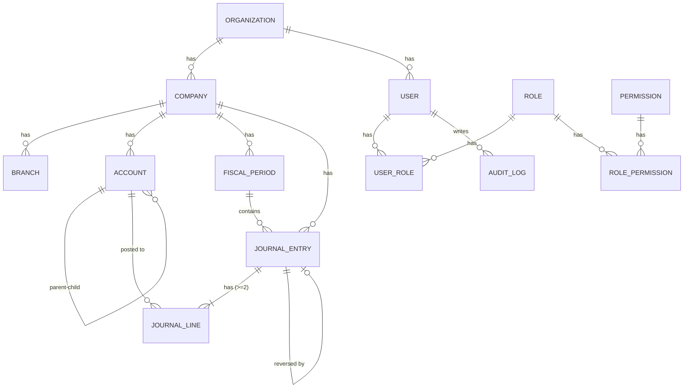
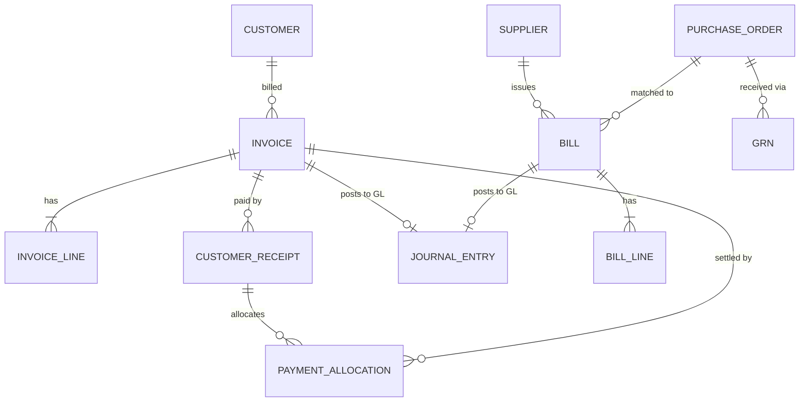

# 02 — Data Model / ERD (§54)

All ~50 core entities from the blueprint, grouped by domain. The Phase-1 subset is implemented
in [`packages/db/prisma/schema.prisma`](../../packages/db/prisma/schema.prisma); later phases extend it.

## Entity groups

| Domain | Entities |
|---|---|
| **Tenancy** | Organization, Company, Branch, Department, CostCentre, Project |
| **Identity** | User, Role, Permission, UserRole, RolePermission |
| **Accounting core** | Account (COA), FiscalPeriod, JournalEntry, JournalLine, AccountingRule, RecurringJournal |
| **Sales / AR** | Customer, Quotation, SalesOrder, DeliveryOrder, Invoice, InvoiceLine, CreditNote, CustomerReceipt, PaymentAllocation |
| **Purchasing / AP** | Supplier, PurchaseRequisition, PurchaseOrder, GRN, Bill, BillLine, DebitNote, SupplierPayment |
| **Inventory** | Product, Warehouse, BinLocation, InventoryTransaction, StockAdjustment, StockTransfer, Batch, SerialNo |
| **Banking** | BankAccount, BankTransaction, BankReconciliation, BankRule |
| **Fixed assets** | Asset, Depreciation, AssetDisposal |
| **People** | Employee, Payroll, PayrollItem, LeaveRecord, AttendanceRecord |
| **Tax** | TaxCode, TaxTransaction |
| **Planning** | Budget, BudgetLine |
| **Platform** | Attachment, Workflow, Approval, Task, Notification, AuditLog, Automation, ApiKey, Webhook |

## Core accounting relationships (Phase 1)

## Commercial relationships (Phase 2 preview)

## Design rules

- Every transactional document (Invoice, Bill, Payment, Payroll run, Depreciation run…) that hits
  the books links to exactly one `JournalEntry` via `JournalEntry.source` + `sourceId`.
- Money columns are `DECIMAL(18,2)` in base currency; foreign-currency documents also store
  transaction currency + rate (Phase 4).
- Soft-delete is **not** used for posted accounting data — reverse instead. Master data (customers,
  products) uses `isActive` flags.
- Multi-tenancy is enforced by `companyId` on every company-scoped table, always indexed.

See [03 — Data Dictionary](03-data-dictionary.md) for column-level detail.
